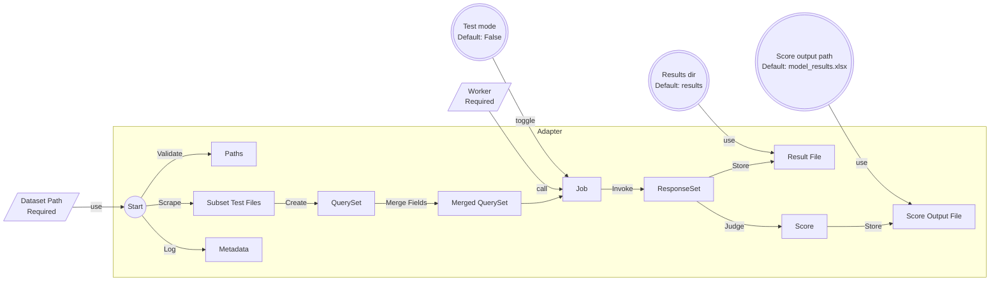

# REAL

- [REAL](#real)
  - [About](#about)
  - [Installation](#installation)
  - [Example Usage](#example-usage)
  - [Workflow Orchestration in Adapters](#workflow-orchestration-in-adapters)
  - [Timeout, max attempts and batch size](#timeout-max-attempts-and-batch-size)
  - [Extensibility](#extensibility)
  - [Appendix](#appendix)
    - [Text Preprocessors](#text-preprocessors)
    - [Evaluation Defaults](#evaluation-defaults)

## About

REAL (RESTful Evaluation Automation Layer) is a tool for evaluation LLMs via RESTful APIs. It is designed to be a layer between the LLM api and test datasets.

Features:

- **API-based evaluation**: Benchmark LLM performances via any OpenAI-compatible api, in a fashion closer to real-world scenarios.
- **Workers**: Benchmark tasks are assigned to workers. A worker takes its profile (model name, base url and api key, and model parameters) and conduct batched requests/score judging.
- **Dataset adapters**: The evaluation logic is encapsulated in adapters, dedicated to meet the requirements of differnt data structures of datasets.
- **Create adapters**: Customize the evaluation workflow by creating adapters that cater to specific needs.
- **Evaluation presets**: A bunch already: mmlu/cmmlu/mmlu_pro/ifeval/humaneval/gpqa (datasets are not included)
- **Score judging**: Conduct flexible score judging via response/answer preprocessor chain. CoT? Reflection? Preprocess it.

## Installation

1. Install dependencies. Run `pip install -r requirements.txt` in your preferred environment. I recommend miniconda

```bash
# Create a conda virtual environment
conda create -n REAL python=3.12
conda init
conda activate REAL
```

2. Download/Prepare dataset

open-compass provides a nice compilation of popular datasets:

```sh
# Download dataset to datasets/ folder
wget https://github.com/open-compass/opencompass/releases/download/0.2.2.rc1/OpenCompassData-core-20240207.zip
unzip OpenCompassData-core-20240207.zip
```

3. (Optional) Install nltk resource file. Ifeval requires it.

```python
import nltk
nltk.download("punkt_tab")
# True
```

Humaneval uses `parquet` format by default. In that case, you will have to convert that to `jsonl` first:

```python
import pandas as pd
df = pd.read_parquet(...)
df.to_json('test.jsonl', orient='records', lines=True)
# test.jsonl
```

Happy evaluation!

## Example Usage

> It is strongly advised to run with test_mode=True first. This can prevent unexpected behavior during evaluation, and if you plan to use max_subset_size for each subset of a greater dataset, this can provide an overview and help you decide a reasonable max_subset_size.

REAL starts at `run.py`. It gives you plenty of flexibility in workflow, but meanwhile requires you to do some over-the-loop work.

For tailored workflows, be sure to create custom `run_*.py` files.

1. **Create an .env file**: Look at .env.example which has all the required env variables. Duplicate it, create a `.env`, and fill in your own values.

2. **Locate a dataset**: Take your own datasets. Put it in `datasets` directory (nested directories are supported).<br/>Currently, REAL provides a limited bunch of preset adapters. But theoretically you can use REAL for any xlsx/csv/jsonl dataset.<br/>
You might need to implement your own adapter for dataset structures other than the typical mcq scheme `[question, a,  b, c, d, answer]`. See "Workflow Orchestration in Adapters" for guidance in creating one.

3. **Create a worker @`run.py`** :A worker takes a `RequestParams` instance which is its profile. It will `invoke` requests following this profile.
> If you wish to not use certain parameters, either 1) leave them as blank in .env file, or 2) explicitly use `None` at runtime. e.g. Avoid top_p when using temperature.
> Find some handy prompts in prompts/

4. **Call an adapter @`run.py`**: An adapter wraps the evaluation logic and takes
    - **the dataset directory**
    - **the worker**
    - **response preprocessor**: This shall process the responses before evaluating, extract the answer body, etc.
    - optional parameters required by specific datasets, see respective docstrings
    - test mode: only evaluating the first 10 questions

Optionally, you can start from `run_custom.py` (for evaluating single custom file) or `run_requests_only.py` (for batch requests without score judging). Go check the entrance files, they are pretty self-explanatory.

Below is an example of how to use an adapter.

```python
# Locate a dataset
dataset_path = "path/to/mmlu/dataset"

# Create a worker
worker_profile = RequestParams(
  model="deepseek-chat",
  temperature=0,
  max_tokens=2048,
  frequency_penalty=0
  system_prompt="You are a helpful assistant."
)

industrious_worker = Worker(worker_profile)

# Call an adapter
await conduct_mmlu(dataset_path, worker, response_preprocessor = mcq_search_preprocessor, max_subset_size = 50)
```

## Workflow Orchestration in Adapters

Read through to learn how to customize an adapter. An adapter is dedicated to these procedures:

**Pre**
- Validate dataset and results path. This helps prevent braindead mistakes like FileNotFoundError after 10,000 questions have been evaluated.

**Evaluating**

- Scrape subset test files (csv/xlsx/jsonl) from the dataset directory using `list_files_in_directory`: (`str` -> `str`). An optional file extension criterion can be specified.
- Create `QuerySet` instance with the path of each subset test file path.
- Merge dataset fields if needed. Designed for mcq datasets, `QuerySet` implemented `merge_keys` that connects field names/values with linebreakers.
- Call workers with a `QuerySet` instance and a query field name (which field to request, default to `query`). This creates a `Job`. A `Job` can be `invoke`d to fetch all llm responses and returns them in a `ResponseSet` instance.
  - Orchestrate multiple workers here.
  - (Recommended) Use `asyncio.gather` to run concurrent evaluations.

**Post**

- Call `ResponseSet` method `store_to` with an output path. (supported format: csv, xlsx, jsonl) Storing full response records is highly advised for archiving purposes.
- Call `ResponseSet` async method `judge` with 1) an answer field and 2) an eval name (for marking each subset record) to do score judging. The `judge` method will return a literal dictionary containing scoring info.
  - Be sure to specify a response_processor (default: `as_is`) / answer_processor (default: `as_is`) / judger (default: `STRICT_MATCH`) as you need, unless you are dealing with evaluations where response overhead & redundant parts matter, like in `ifeval`.
  - Some preprocessors are ready at `dataset_adapters.response_preprocessors`.
- Spawn a `ResponseSet` instance with the judge result dictionary to `store_to` a score output file.
- Lastly, log the metadata of evaluation(s). Method `log_resultfile` is provided for templated log files.



## Timeout, max attempts and batch size

Since REAL is essentially an augmented batch request tool, it has these connection settings. Configure them at .env file.

- **Timeout**: Happens when a request has not been responded after a given time (timeout).

```bash
TIMEOUT=60  # 1 minute timeout
```

- **Max attempts**: When api request encountered errors, REAL will retry for this many times.

```bash
MAX_ATTEMPTS=3
```

- **Batch size**: When a query set is submitted to an api, its concurrent request number is limited to `BATCH_SIZE` by a semaphore. 

NOTE: The semaphore is global. If two tasks run through two apis concurrently, they share the max batch size. `SCORING_BATCH_SIZE` works only for scoring and is independent.

```bash
BATCH_SIZE=5
SCORING_BATCH_SIZE=5
```

```python
job1 = worker(dataset_1, "question").invoke()
# This has a semaphore of 5
job2 = worker(dataset_2, "Question").invoke()
# Also has a semaphore of 5
```

## Extensibility

There isn't only mcq scheme, but actually many more types of dataset. From 2.6.0, the `external_eval_methods` module is incorporated, with dataset-specific evaluation modules composed mostly by dataset creators themselves. Thanks must go to all of them, who have layed the foundation together for the prosperity of open-source AI communities. Their code is adapted to REAL's architecture, so that evaluations can be operated in a unified way. The original docs are retained for reference. 

Many of these external modules use file I/O to retrieve/export evaluation processings. REAL is designed to receive these data processings via `dataset_models`, and manage them in `dataset_adapters`, which gives it great potential in extensibility. More effort will be dedicated consistently in facilitating this project's maintenance.

## Appendix

### Text Preprocessors

| Preprocessor Name | Feature | Example |
| --- | --- | --- |
| `as_is` | Keep the response as is. | "Answer: B and more" => "Answer: B and more" |
| `mcq_search_preprocessor` | Search for content between `<answer>` and `</answer>`, then pick the first letter if independent. | `"Gibberish answer. <answer> A. Something. </answer>"` => `"A"`|
| `mcq_preprocessor` | Pick the first, then the last "independent letter" in order. Fall back to `""`. | `"Answer: B and more"` => `""`<br/>`"A\nThis is the answer."` => `"A"` |
| `mcq_cot_preprocessor` | Remove the cot content (surrounded by <think></think>, on failure, return `THINK FAILED MESSAGE`), then run `mcq_preprocessor`. | `"<think>Man! What can I say.</think>B"` => `"B"`|
| `mcq_cot_preprocessor_for_bad_if` | Remove multiple MCQ answers first e.g. "AB" "B, C", then run `mcq_cot_preprocessor`. If the latter failed, run search for `[Aa]nswer:([^\\w]*?)([A-Za-z]+)` and `答案[：:]([^\\w]*?)([A-Za-z]+)`, and `pick_the_first_letter_if_independent`. Fall back to `""`. | `"Gibberish answer. Answer: B. "` => `"B"`<br>`"Gibberish answer. Gibberish answer. The answer is: B"` => `""`|

### Evaluation Defaults

| Eval Name | Temperature | System Prompt | Prompt Prefix | Prompt Suffix | Max Tokens | Judge |
| --- | --- | --- | --- | --- | --- | --- |
| ceval | 0.0 | 请回答一道单项选择题（有唯一正确答案），并在<answer>和</answer>之间输出正确的选项字母。 | | |2048|STRICT_MATCH|
| cmmlu | 0.0 | 请回答一道单项选择题（有唯一正确答案），并在<answer>和</answer>之间输出正确的选项字母。 | | |2048|STRICT_MATCH|
| mmlu | 0.0 | Answer the MCQ (only one option is correct). In your response, present the correct option letter between <answer> and </answer>. | | |2048|STRICT_MATCH|
| gpqa | 0.0 | Answer the MCQ (only one option is correct). In your response, present the correct option letter between <answer> and </answer>. | | |2048|STRICT_MATCH|
| ifeval | 0.0 |  | | |2048|ifeval_judge_strict|
| mmlu_pro | 0.0 | Answer the MCQ (only one option is correct). In your response, present the correct option letter between <answer> and </answer>. | | |2048|STRICT_MATCH|
| humaneval | 0.0 | You are a coder. Complete the following code block according to the docstring with proper indentation. Provide ONLY the completion without additional content.\n | | \# YOUR COMPLETION STARTS HERE\n |512|humaneval_eval_raw_pass|
| supergpqa | 0.0 | Answer the MCQ (only one option is correct). In your response, present the correct option letter between <answer> and </answer>. | | | 2048 | STRICT_MATCH|