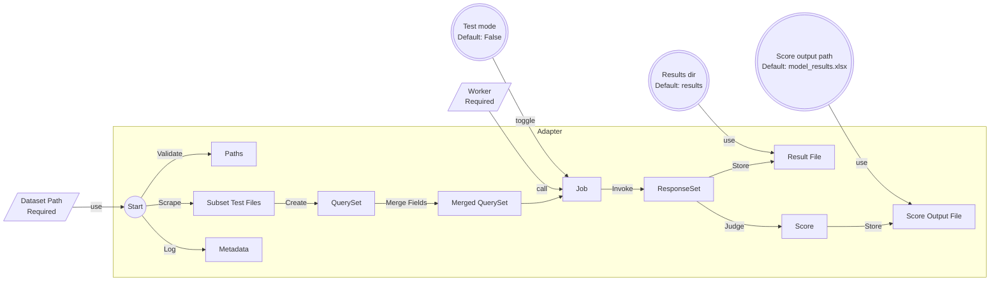

# REAL

- [About](#about)
- [Example Usage](#example-usage)
- [Workflow Orchestration in Adapters](#workflow-orchestration-in-adapters)
- [Timeout and Batch size](#timeout-and-batch-size)

## About

REAL (RESTful Evaluation Automation Layer) is a tool for evaluation LLMs via RESTful APIs. It is designed to be a layer between the LLM api and test datasets.

Features:

- **API-based evaluation**: Benchmark LLM performances via any OpenAI-compatible api, in a fashion closer to real-world scenarios.
- **Workers**: Benchmark tasks are assigned to workers. A worker takes its profile (model name, base url and api key, and model parameters) and conduct batched requests/score judging.
- **Dataset adapters**: The evaluation logic is encapsulated in adapters, dedicated to meet the requirements of differnt data structures of datasets.
- **Create adapters**: Customize the evaluation workflow by creating adapters that cater to specific needs.
- **Evaluation presets**: mmlu/ceval/cmmlu (datasets are not included)
- **Score judging**: Conduct flexible score judging via response/answer preprocessor chain. CoT? Reflection? Preprocess it.

## Example Usage

REAL starts at `run.py`. To start the first evaluation with REAL, follow the steps:

0. **Create an .env file**: Look at .env.example which has all the required env variables. Duplicate it, create a `.env`, and fill in your own values.

1. **Locate a dataset**: Take your own datasets. Put it in `datasets` directory (nested directories are supported).
> Currently, REAL supports ceval, cmmlu and mmlu. But theoretically you can use REAL for any xlsx/csv/jsonl dataset.

> You might need to implement your own adapter for dataset structures other than the typical mcq structure `[question, a,  b, c, d, answer]`. Keep reading for how an adapter is used in REAL architecture.

2. **Create a worker @`run.py`** :A worker takes a `RequestParams` instance which is its profile. It will `invoke` requests following this profile.
> If you wish to not use certain parameters, either 1) leave them as blank in .env file, or 2) explicitly use `None` at runtime. e.g. Avoid top_p when using temperature.

3. **Call an adapter @`run.py`**: An adapter wraps the evaluation logic and takes
    - **the dataset directory**
    - **the worker**
    - results dir (Optional: default to `results`; for where to store responses)
    - score output path (Optional: default to `model_results.xlsx`; for storing the metrics to a file)
    - test mode (Optional: default to `False`; evaluate only the first subset, used for debug purposes).

Below is an example of how to use an adapter.

```python
# Locate a dataset
dataset_path = "path/to/mmlu/dataset"

# Create a worker
worker_profile = RequestParams(
  model="deepseek-chat",
  temperature=0,
  max_tokens=128,
  frequency_penalty=0
  system_prompt="You are a helpful assistant."
)

industrious_worker = Worker(worker_profile)

# Call an adapter
await conduct_mmlu(dataset_path, worker)
```

## Workflow Orchestration in Adapters

Read through to learn how to customize an adapter. An adapter is dedicated to these procedures:

**Pre**
- Validate dataset and results path. This helps prevent braindead mistakes like FileNotFoundError after 10,000 questions have been evaluated.

**Evaluating**

- Scrape subset test files (csv/xlsx/jsonl) from the dataset directory using `list_files_in_directory`: (`str` -> `str`). An optional file extension criterion can be specified.
- Create `QuerySet` instance with the path of each subset test file path.
- Merge dataset fields if needed. Designed for mcq datasets, `QuerySet` implemented `merge_keys` that connects field names/values with linebreakers.
- Call workers with a `QuerySet` instance and a query field name (which field to request, default to `query`). This creates a `Job`. A `Job` can be `invoke`d to fetch all llm responses and returns them in a `ResponseSet` instance.
  - Orchestrate multiple workers here.

**Post**

- Call `ResponseSet` method `store_to` with an output path. (supported format: csv, xlsx, jsonl) Storing full response records is highly advised for archiving purposes.
- Call `ResponseSet` method `judge` with 1) an answer field and 2) an eval name (for marking each subset record) to do score judging. The `judge` method will return a literal dictionary containing scoring info.
  - You may specify a response_processor (default: as_is) / answer_processor (default: as_is) / judger (default: `STRICT_MATCH`) as you need. 
  - Some preprocessors are ready at `dataset_adapters.response_preprocessors`.
- Spawn a `ResponseSet` instance with the judge result dictionary to `store_to` a score output file.
- Lastly, log the metadata of evaluation(s). Method `log_resultfile` is provided for templated log files.



## Timeout, max attempts and Batch size

Since REAL is essentially an augmented batch request tool, it has these connection settings. Configure them at .env file.

- **Timeout**: Happens when a request has not been responded after a given time (timeout).

```bash
TIMEOUT=60  # 1 minute timeout
```

- **Max attempts**: When api request encountered errors, REAL will retry for this many times.

```bash
MAX_ATTEMPTS=3
```

- **Batch size**: When a query set is submitted to an api, its concurrent request number is limited to `BATCH_SIZE` by a semaphore. 

NOTE: The semaphore is JOB-SPECIFIC: each job launches a process_batch which has a semaphore, so 2 jobs invoked at a time can launch `2 * BATCH_SIZE` concurrent requests.

```bash
BATCH_SIZE=5
```

```python
job1 = worker(dataset_1, "question").invoke()
# This has a semaphore of 5
job2 = worker(dataset_2, "Question").invoke()
# Also has a semaphore of 5
```